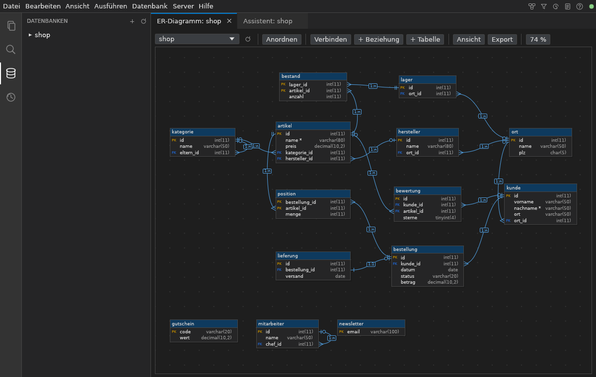
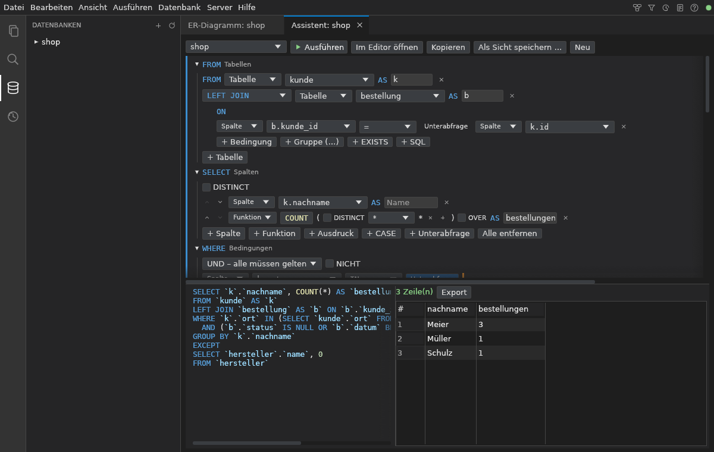
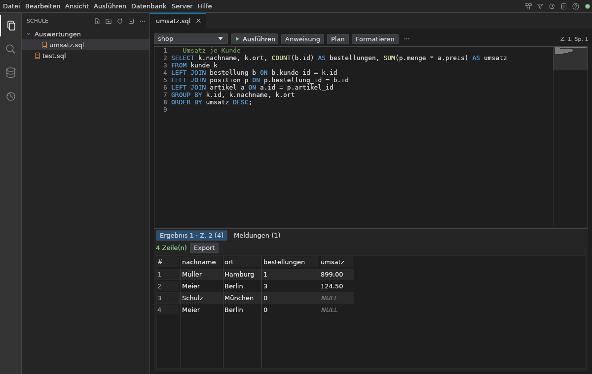

# EasyMySQL

MariaDB-Datenbankserver und grafische Datenbankverwaltung für Windows in **einem** Programm.
Einmal installieren, starten, und `mysql -u root` funktioniert in der Eingabeaufforderung.



## Installation

1. Unter [Releases](https://github.com/gravijet/EasyMySQL/releases) die Datei `EasyMySQL-Setup-x.y.z.exe` herunterladen und ausführen
   (enthält bereits alles, funktioniert auch ohne Internet).
   (Windows SmartScreen: *Weitere Informationen → Trotzdem ausführen*.)
2. EasyMySQL starten. Beim ersten Start wird der Datenbankserver automatisch eingerichtet.
3. In der Eingabeaufforderung (cmd):

   ```
   mysql -u root
   ```

Das Setup installiert bzw. setzt:

| Was | Wo |
|---|---|
| EasyMySQL | `C:\Program Files\EasyMySQL\EasyMySQL.exe` |
| MariaDB 11.8 LTS (Server und alle Kommandozeilenprogramme: `mysql`, `mariadb`, `mysqldump`, `mysqladmin`, ...) | `C:\Program Files\EasyMySQL\mariadb` |
| Umgebungsvariable `PATH` (damit `mysql` überall funktioniert) | `...\EasyMySQL\mariadb\bin` |
| Umgebungsvariablen `EASYMYSQL_HOME`, `MARIADB_HOME` | Installationsordner |
| MariaDB ODBC-Treiber 3.2 und ODBC-Datenquelle **EasyMySQL** (optional, z. B. für Excel/Access) | Systemweit |
| Microsoft Visual C++ Laufzeit | Systemweit |
| Datenbanken (Datenordner) | `C:\ProgramData\EasyMySQL\data` |

Zugang: Server `127.0.0.1`, Port `3306`, Benutzer `root`, **kein Passwort**.
Der Server ist nur vom eigenen PC aus erreichbar (`bind-address=127.0.0.1`).

## Datensicherheit, Sicherungen und Reparatur

- **Absturzsicher**: MariaDB läuft mit InnoDB und sofortigem Schreiben jeder bestätigten Änderung
  (`innodb_flush_log_at_trx_commit=1`, Doublewrite). Auch wenn EasyMySQL oder der PC hart beendet
  wird (Task-Manager, Stromausfall), gehen bestätigte Daten nicht verloren. Getestet mit
  `kill -9` mitten in zehntausenden Schreibvorgängen: keine einzige bestätigte Zeile fehlte.
- **Windows herunterfahren/abmelden**: EasyMySQL fährt die Datenbank vorher sauber herunter.
- **Nach einem Absturz** erkennt EasyMySQL das beim nächsten Start, MariaDB stellt die Daten
  automatisch wieder her und EasyMySQL prüft danach alle Tabellen.
- **Automatische Sicherungen** (*Server → Sicherungen & Reparatur*): beim Start und alle 2 Stunden,
  außerdem automatisch **vor jedem Löschen/Leeren** von Datenbanken und Tabellen (auch im
  SQL-Editor: `DROP`, `TRUNCATE`, `DELETE`/`UPDATE` ohne `WHERE`). Aufbewahrt werden die letzten 10
  und eine pro Tag für 14 Tage (einstellbar, Ordner frei wählbar, z. B. USB-Stick).
  Wiederherstellen per Klick, auch unter neuem Namen.
- **Reparieren per Knopfdruck**:
  - *Prüfen und reparieren*: prüft alle Tabellen (`CHECK TABLE`) und repariert beschädigte.
  - *MyISAM → InnoDB*: wandelt nicht absturzsichere Tabellen um (EasyMySQL weist darauf hin).
  - *Server retten*: wenn MariaDB gar nicht mehr startet. Der alte Datenordner bleibt erhalten,
    die Daten werden gerettet (notfalls aus der neuesten Sicherung) und in einen neuen
    Datenordner eingespielt.

## Verhalten

- Der Datenbankserver läuft **nur, solange EasyMySQL geöffnet ist**.
- Schließen mit **X** beendet das Programm nicht. Es läuft im Infobereich (neben der Uhr) weiter,
  damit `mysql -u root` weiter funktioniert.
- Richtig beenden: Rechtsklick auf das Symbol im Infobereich → **Beenden** (oder *Datei → Beenden*).
  Dabei wird der Server sauber heruntergefahren.
- **Kein Autostart** mit Windows.
- Es läuft immer nur eine EasyMySQL-Instanz. Ein zweiter Start holt das vorhandene Fenster nach vorne.

## Funktionen

Die Oberfläche ist wie Visual Studio Code aufgebaut: links die Aktivitätsleiste mit den Seitenleisten
**Explorer, Suchen, Datenbanken, Verlauf**, in der Mitte Registerkarten. Werkzeuge, die eine
Registerkarte öffnen (ER-Diagramm, Abfrage-Assistent, Sicherungen, Server-Log, Handbuch), liegen oben
rechts neben dem Menü. Das komplette **Handbuch** mit Suche steht unter *Hilfe → Handbuch* (F1).

- **Projektordner**: beliebige Ordner öffnen (*Datei → Ordner öffnen*), neue Projekte im
  Speicherordner anlegen, zuletzt geöffnete Projekte. Dateien und Ordner anlegen, umbenennen,
  löschen (in den Projekt-Papierkorb), Suche über alle Dateien.
- **Speicherorte frei wählbar**: der Speicherordner (Standard `Dokumente\EasyMySQL`) enthält neue
  Projekte, unbenannte Abfragen, frühere Fassungen, Verlauf, Diagramm-Anordnungen und den Inhalt des
  Abfrage-Assistenten. Beim Wechsel kann der Inhalt mitgenommen werden. Der Sicherungsordner ist
  ebenfalls frei wählbar.
- **Automatisch speichern**, frühere Fassungen je Datei, alle Registerkarten beim nächsten Start
  wieder da. Nach dem Schließen der letzten Registerkarte bleibt die Fläche einfach leer.
- **SQL-Editor**: Hervorhebung, Vorschläge (auch nach `alias.`), Suchen/Ersetzen, Zeile
  ausschneiden (`Strg+X` ohne Markierung), duplizieren (`Strg+D`), verschieben, kopieren,
  kommentieren, Minimap. Mehrere Anweisungen je Datei, `DELIMITER`, eigenes Ergebnis je Anweisung,
  EXPLAIN, Fehler auf Deutsch erklärt. Export von Ergebnissen als CSV, JSON, SQL, Markdown.
- **Formatieren**: SQL-Wörter groß, jede Klausel auf eigener Zeile, Listen und Bedingungen werden erst
  umbrochen, wenn die Zeile zu lang wird. Kommentare, Prozeduren und `DELIMITER` bleiben unverändert.
- **Abfrage-Assistent**: beliebige SELECT-Abfragen grafisch – alle JOIN-Arten, Aliase (`AS`),
  Ausdrücke, über 60 Funktionen, CASE, CAST, Fensterfunktionen (`OVER`), Unterabfragen überall (als
  Tabelle, Wert, `IN`, `ANY`/`ALL`, `EXISTS`), verschachtelte UND/ODER-Gruppen, `GROUP BY` mit
  `ROLLUP`, `HAVING`, `ORDER BY`, `LIMIT`/`OFFSET`, `UNION`/`EXCEPT`/`INTERSECT` (jeweils auch `ALL`),
  `WITH` und `WITH RECURSIVE`. Ergebnis sofort sichtbar, als Sicht speichern oder in den Editor übernehmen.
- **ER-Diagramm**: liest die Struktur einer Datenbank aus, 1:1, 1:n und n:m, Notation Krähenfuß, Chen
  oder (min,max). **Automatisch anordnen**: verbundene Tabellen nebeneinander, möglichst keine
  Kreuzungen, keine Linie durch fremde Tabellen, ungefähr Bildschirmformat. **Beziehungen hinzufügen**
  (ziehen oder Modus „Verbinden“) und **entfernen** (Linie anklicken, Entf). Export als SVG und SQL.
- **Datenbanken**: Baum mit Tabellen und Spalten, Daten ansehen und bearbeiten, Struktur ändern,
  Tabellen-Designer, Export/Import als SQL.
- **Verlauf** aller ausgeführten Anweisungen, erneut öffnen oder ausführen.
- **Server-Log**: wird immer mitgeschrieben (auch in die Datei `server.log`), mit Zeitstempel und
  Filter. Auf Wunsch wird jede Anweisung an den Server protokolliert – auch aus `mysql` in der
  Eingabeaufforderung.
- **Befehle** (`Strg+Umschalt+P`) und **Datei schnell öffnen** (`Strg+P`).
- **Tastenkürzel frei belegbar** (*Einstellungen → Tastenkürzel*), mehrere Kürzel je Befehl,
  Konflikte werden angezeigt.
- **Maus**: Scrollgeschwindigkeit einstellbar; mittlere Maustaste gedrückt halten und ziehen scrollt
  schnell in jede Richtung.
- **Visual Studio Code + GitHub Copilot**: *Server → VS Code einrichten* installiert SQLTools mit
  MariaDB-Treiber und legt die Verbindung „EasyMySQL“ an.



### Wichtige Tastenkürzel (Standard)

| Taste | Funktion |
|---|---|
| `Strg+Alt+S` oder `F5` | Datei bzw. Markierung ausführen |
| `Strg+Enter` | Anweisung am Cursor ausführen |
| `Strg+E` | Ausführungsplan (EXPLAIN) |
| `Strg+Alt+L` | SQL formatieren |
| `Strg+X` / `Strg+D` / `Strg+Umschalt+K` | Zeile ausschneiden / duplizieren / löschen |
| `Alt+↑/↓`, `Alt+Umschalt+↑/↓` | Zeile verschieben / kopieren |
| `Strg+#` | Kommentar ein/aus |
| `Strg+F` / `Strg+H` / `Strg+G` | Suchen / Ersetzen / Gehe zu Zeile |
| `Strg+Leertaste` | Vorschläge |
| `Strg+Umschalt+P` / `Strg+P` | Befehle / Datei öffnen |
| `Strg+N` / `Strg+W` / `Strg+Umschalt+T` | neue Abfrage / Registerkarte schließen / wieder öffnen |
| `Strg+B` | Seitenleiste ein/aus |
| `Strg+,` / `F1` | Einstellungen / Handbuch |

Alle Kürzel lassen sich unter *Einstellungen → Tastenkürzel* ändern.



## Selbst bauen

Voraussetzung: [Rust](https://rustup.rs) (stable).

```
cargo build --release
```

Für das komplette Setup (MariaDB, Treiber, Inno Setup) siehe `.github/workflows/release.yml`.
Der Build holt automatisch die neueste MariaDB-Version der LTS-Reihe 11.8 (mit Prüfsumme); ist die
MariaDB-Schnittstelle nicht erreichbar, wird die fest hinterlegte Version 11.8.9 aus dem MariaDB-Archiv verwendet.
Das fertige Setup enthält MariaDB bereits vollständig und installiert komplett offline.
Nach einem Update auf eine neuere MariaDB-Version passt EasyMySQL die Systemtabellen beim Start automatisch an (`mariadb-upgrade`).
Jeder Push auf `main` baut das Setup automatisch auf GitHub und veröffentlicht es als
Release `vX.Y.Z` (Version aus `Cargo.toml`).

Tests: `cargo test`. Die mit `#[ignore]` markierten Tests brauchen einen laufenden Server auf
Port 3306 mit passender Datenbank (`cargo test -- --ignored`).

Zum Entwickeln unter Linux sucht EasyMySQL `mariadbd` in `/usr/sbin`. Mit der Umgebungsvariable
`EASYMYSQL_MARIADB_BIN` kann ein anderer MariaDB-`bin`-Ordner angegeben werden.

## Aufbau

| Datei | Inhalt |
|---|---|
| `src/main.rs` | Programmstart, Fenster, nur eine Instanz |
| `src/app.rs` | Hauptfenster: Befehle, Aktionen, Server, Mausrad und Scrollen mit der mittleren Maustaste |
| `src/app/shell.rs`, `side.rs`, `dialogs.rs`, `palette.rs` | Menü, Registerkarten, Seitenleisten, Dialoge, Befehlsliste |
| `src/keymap.rs` | alle Befehle mit Standard-Tastenkürzeln, eigene Belegung |
| `src/settings.rs`, `src/workspace.rs` | Einstellungen; Speicherordner, Projekte, sicheres Speichern, frühere Fassungen, Sitzung |
| `src/server.rs` | MariaDB einrichten, starten, stoppen, Server-Log, Absturzerkennung, Rettung |
| `src/backup.rs`, `src/repair.rs` | Sicherungen, Prüfen und Reparieren |
| `src/db.rs` | Verbindung, Abfragen, Anweisungen trennen, Metadaten, Beziehungsarten, SQL-Export |
| `src/sqledit.rs`, `src/sqlfmt.rs` | Code-Editor; SQL-Formatierer |
| `src/qhistory.rs` | Verlauf der ausgeführten Anweisungen |
| `src/tabs/` | SQL-Editor, Daten, Struktur, Tabellen-Designer, ER-Diagramm (+ Anordnung), Abfrage-Assistent (Modell + Oberfläche), Sicherungen, Server-Log, Einstellungen, Handbuch |
| `src/icons.rs`, `src/style.rs` | selbst gezeichnete Symbole, Farbschemata |
| `src/vscode.rs`, `src/platform.rs` | Visual Studio Code; Windows-Infobereich und Herunterfahren |
| `installer/EasyMySQL.iss` | Inno-Setup-Skript |

Lizenz: EasyMySQL unter MIT. MariaDB steht unter der GPL v2.
