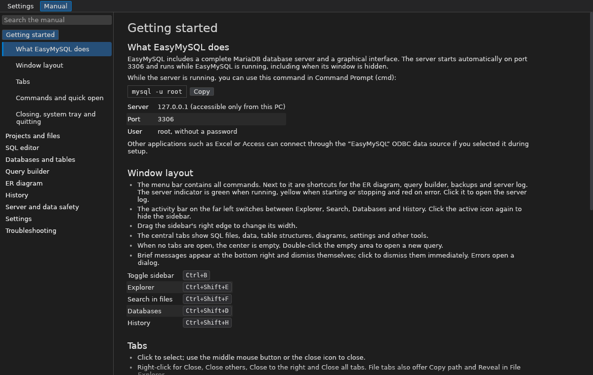

# EasyMySQL

A MariaDB database server and graphical database manager for Windows in **one application**.
Install it once, launch it, and use `mysql -u root` in Command Prompt.

The interface starts in **English with dark mode**. Choose German or a light theme under **Settings → Appearance**. Menus show the active category and give subitems room to breathe.


## Installation

1. Download `EasyMySQL-Setup-x.y.z.exe` from [Releases](https://github.com/gravijet/EasyMySQL/releases) and run it. MariaDB is included, so installation works offline. If Windows SmartScreen reports an unknown publisher, choose *More info → Run anyway*.
2. Launch EasyMySQL. Its database server is initialized automatically on first launch.
3. Open Command Prompt (cmd):

   ```console
   mysql -u root
   ```

| Component | Location |
|---|---|
| EasyMySQL | `C:\Program Files\EasyMySQL\EasyMySQL.exe` |
| MariaDB 11.8 LTS server and command-line tools (`mysql`, `mariadb`, `mysqldump`, `mysqladmin`, …) | `C:\Program Files\EasyMySQL\mariadb` |
| `PATH` entry for the command-line tools | `...\EasyMySQL\mariadb\bin` |
| `EASYMYSQL_HOME`, `MARIADB_HOME` | Installation folders |
| MariaDB ODBC driver 3.2 and **EasyMySQL** data source (optional, for Excel/Access and other applications) | System-wide |
| Microsoft Visual C++ runtime | System-wide |
| Database data directory | `C:\ProgramData\EasyMySQL\data` |

Default connection: `127.0.0.1`, port `3306`, user `root`, **no password**. The bundled server is accessible only from the same PC (`bind-address=127.0.0.1`).

A portable ZIP is also available. Extract it and launch `EasyMySQL.exe`; the portable version does not modify `PATH`.

## Data safety, backups and recovery

- **Crash safety:** MariaDB uses InnoDB with `innodb_flush_log_at_trx_commit=1` and doublewrite enabled, so committed changes are flushed to disk. Windows shutdown and sign-out stop the server cleanly. After an interrupted session, MariaDB recovers its data and EasyMySQL checks the tables.
- **Automatic backups:** run at startup and every two hours by default, and before deleting or emptying databases and tables. The SQL editor also backs up before `DROP`, `TRUNCATE`, and `DELETE`/`UPDATE` without `WHERE`. Destructive statements are not executed if that backup fails.
- **Configurable retention:** keep the latest ten backups plus one per day for fourteen days by default. Choose a backup folder, including a USB drive or network share. Restore into an existing database or under a new name.
- **Check and repair:** checks all tables with `CHECK TABLE` and attempts to repair damaged ones after backing up.
- **MyISAM → InnoDB:** converts tables without crash protection; EasyMySQL warns about them when connecting.
- **Recover server:** preserves the old data folder, attempts recovery on a copy, and restores recovered data into a new directory, using the latest backup when needed. User accounts are reset to `root` without a password.

Open **Server → Backups & repair** to manage these tools.

## Application behavior

The database server runs while EasyMySQL is running. Closing the window hides it in the system tray beside the clock, so command-line connections continue to work. Click the tray icon to restore the window. Choose **File → Quit**, or **Quit** from the tray menu, to stop the server and exit. EasyMySQL does not start automatically with Windows. Starting a second instance brings the existing window to the front.

## Features

The interface follows an editor layout: an activity bar for **Explorer, Search, Databases and History**, a resizable sidebar, and tabs in the center. Toolbar shortcuts open the ER diagram, query builder, backups and server log. **Help → Manual** (`F1`) provides a searchable handbook in the selected language.

- **Projects and files:** open any folder, create projects, reopen recent folders, create/rename/delete files and folders, and search across project files. Deletion moves files into the project's recycle folder.
- **Flexible storage:** choose where to keep projects, untitled queries, previous versions, history, diagram layouts and builder content. The default is `Documents\EasyMySQL`. Changing folders can move existing content and update open files and recent projects. Backup storage is configurable separately.
- **English and German:** switch languages in Settings. Menus, commands, tooltips, dialogs, error hints, keyboard shortcut names and the handbook follow the chosen language. English is the default for installations without a saved language preference.
- **Dark and light themes:** dark mode is the default; either theme is selectable in Settings. Highlighted categories follow navigation and scrolling, with indented subitems.
- **GitHub updates:** check the latest stable release at startup and every six hours, or manually through **Help → Check for updates**. Automatic checks can be disabled. Download and start the Windows installer from the app; SHA-256 checksums are verified before installation. Files are saved and the server is stopped cleanly first.
- **Close all tabs:** available from the File menu, tab context menu or `Ctrl+Shift+W`. Files are saved and closed tabs can be reopened individually.
- **Autosave and restoration:** edits save after a short pause; previous versions are kept per file. Open tabs and untitled queries return after restarting. The center stays empty when the last tab closes.
- **SQL editor:** syntax highlighting, completion including after `alias.`, find/replace, line editing, comments and a minimap. Execute multiple statements with separate results, use `DELIMITER`, inspect `EXPLAIN`, and read localized error hints. Export CSV, JSON, SQL or Markdown.
- **SQL formatting:** capitalize keywords and lay out clauses, lists and conditions. Comments, procedures, quoted text and `DELIMITER` blocks remain intact.
- **Query builder:** all JOIN types, aliases, expressions, over sixty functions, CASE, CAST, window functions, subqueries, AND/OR groups, `GROUP BY` with `ROLLUP`, `HAVING`, sorting, pagination, `UNION`/`EXCEPT`/`INTERSECT` including `ALL`, and `WITH RECURSIVE`. Execute queries, save a view or open the generated SQL in the editor.
- **ER diagrams:** display 1:1, 1:n and n:m relationships with Crow's foot, Chen or (min,max) notation. Arrange tables automatically, pan/zoom, create relationships by dragging, delete selected relationships, and export SVG or CREATE TABLE SQL.
- **Database tools:** browse tables and columns, edit rows, alter structure, design tables and import/export SQL.
- **Query history:** reopen or rerun statements with timestamps, databases and durations.
- **Server log:** always records server messages to `server.log`. Optional query logging includes statements from Command Prompt and other programs.
- **Custom shortcuts:** assign multiple combinations per command and see conflicts. Menus and the handbook show the current bindings.
- **Mouse controls:** adjustable wheel speed and middle-button drag scrolling; the middle button pans diagrams and closes tabs.
- **VS Code integration:** **Server → Set up VS Code** installs SQLTools and its MariaDB driver and creates the EasyMySQL connection. Changes saved in VS Code appear in EasyMySQL.



### Default keyboard shortcuts

| Shortcut | Action |
|---|---|
| `Ctrl+Alt+S` or `F5` | Run file or selection |
| `Ctrl+Enter` | Run statement at cursor |
| `Ctrl+E` | Execution plan (EXPLAIN) |
| `Ctrl+Alt+L` | Format SQL |
| `Ctrl+X` / `Ctrl+D` / `Ctrl+Shift+K` | Cut / duplicate / delete line |
| `Alt+↑/↓` / `Alt+Shift+↑/↓` | Move / copy line |
| `Ctrl+/` | Toggle comment |
| `Ctrl+F` / `Ctrl+H` / `Ctrl+G` | Find / replace / go to line |
| `Ctrl+Space` | Suggestions |
| `Ctrl+Shift+P` / `Ctrl+P` | Commands / quick open |
| `Ctrl+N` / `Ctrl+W` / `Ctrl+Shift+T` | New query / close tab / reopen tab |
| `Ctrl+Shift+W` | Close all tabs |
| `Ctrl+B` | Toggle sidebar |
| `Ctrl+,` / `F1` | Settings / manual |

Customize shortcuts under **Settings → Keyboard shortcuts**.

## Performance

The editor reuses syntax highlighting and glyph layout until text, font, theme or display scale changes, and renders only visible line numbers. SQL results are displayed without copying the whole result set per frame. Project trees and diagram schemas are shared, diagram routes are cached across panning and zooming, and file searches and project scans run in the background. Log filtering and formatted builder SQL are cached; unchanged sessions avoid repeated disk writes.

The manual rendering benchmarks use a 5,000-line SQL file and a 50,000-row result with twelve columns. Run them with:

```console
cargo test --locked performance_render -- --ignored --nocapture --test-threads=1
```

## Building and testing

Install [Rust](https://rustup.rs) stable, then run:

```console
cargo build --release --locked
cargo test --locked
```

The complete Windows installer is built by [the release workflow](.github/workflows/release.yml). It downloads the latest MariaDB release in the 11.8 LTS series and verifies its checksum. If the download API is unavailable, it uses the pinned MariaDB 11.8.9 archive. The installer bundles MariaDB for offline installation. System tables are upgraded with `mariadb-upgrade` when needed.

Pushing code to `main` builds and publishes `vX.Y.Z`, using the version in `Cargo.toml`. Documentation-only pushes do not trigger a release. The workflow can also be run manually.

Some ignored tests require a running database server and matching sample databases; the rendering benchmarks are ignored because they are manual measurements. Under Linux, development builds look for `mariadbd` in `/usr/sbin`; override this with `EASYMYSQL_MARIADB_BIN`.

## Source layout

| Files | Purpose |
|---|---|
| `src/main.rs`, `src/app.rs` | Startup, main window, commands, server lifecycle and scrolling |
| `src/app/` | Menus, tabs, sidebars, dialogs and command palette |
| `src/i18n.rs` | English/German translations and language selection |
| `src/keymap.rs` | Commands, default bindings and custom shortcuts |
| `src/settings.rs`, `src/workspace.rs` | Preferences, storage, projects, atomic saves, previous versions and sessions |
| `src/server.rs`, `src/backup.rs`, `src/repair.rs` | Server setup, lifecycle, logs, backups and recovery |
| `src/db.rs` | Connections, queries, metadata, relationships and SQL export |
| `src/sqledit.rs`, `src/sqlfmt.rs` | SQL editor, cached syntax layout and formatter |
| `src/qhistory.rs`, `src/tabs/` | History and the individual tool tabs |
| `src/icons.rs`, `src/style.rs` | Vector icons, dark/light palettes and navigation |
| `src/updates.rs` | GitHub release checks, verified downloads and Windows installer launch |
| `src/vscode.rs`, `src/platform.rs` | VS Code integration and Windows tray/shutdown support |
| `installer/EasyMySQL.iss` | English/German Inno Setup installer |

EasyMySQL is licensed under MIT. MariaDB is licensed under GPL v2.
